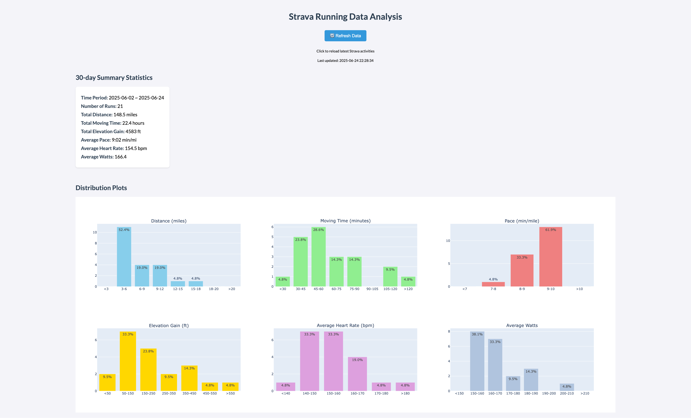

# Strava Data Analysis Dashboard
**This is a project aim to use AI Code Editor `CURSOR`**  
*Below descriptions along with 80% of codes are generated by AI. Manual fine tune are involved.*

## 🏃‍♂️ Features

### Data Collection
- **Automated Strava API Integration**: Fetches activities using Strava's official API
- **Pagination Support**: Handles large datasets by automatically paginating through all activities
- **Scheduled Collection**: Runs data collection every 24 hours (configurable)
- **Token Management**: Automatic refresh of expired access tokens
- **Data Persistence**: Saves timestamped CSV files in organized structure

### Data Analysis
- **Performance Metrics**: Pace, distance, elevation, heart rate, and power data
- **Weekly Aggregations**: Cumulative mileage tracking by week
- **Statistical Summaries**: Average pace, heart rate, and power calculations

### Visualization
- **Interactive Dashboards**: Plotly-based visualizations with real-time data
- **Distribution Charts**: Histograms for distance, time, pace, elevation, heart rate, and power
- **Summary Statistics**: Key metrics displayed in clean, readable format
- **Responsive Design**: Works on desktop and mobile devices

### Background Processing
- **Agent System**: Automated background processing with monitoring
- **Process Management**: Automatic restart of failed processes
- **Logging**: Comprehensive logging for debugging and monitoring
- **Graceful Shutdown**: Clean process termination and resource cleanup

## 🚀 Quick Start

### Prerequisites
- Python 3.7+
- Strava API credentials
- Required Python packages (see requirements.txt)

### Installation

1. **Clone or download the project**

2. **Install dependencies**
   ```bash
   pip3 install -r requirements.txt
   ```

3. **Set up Strava authentication**
   - Set environment variables:
     ```bash
     export STRAVA_CLIENT_ID="your_client_id"
     export STRAVA_CLIENT_SECRET="your_client_secret"
     ```
   - Run the notebook to authenticate:
     ```bash
     # MAIN WORKFLOW
        from strava import get_authorization_url, exchange_code_for_token
        # 1. First-time only: print URL and paste back code
        print("Visit this URL and get the code:")
        print(get_authorization_url())
        # After visiting and authorizing, paste the ?code=XXXXX from the redirect URL
        auth_code = input("Paste the code here: ")
        exchange_code_for_token(auth_code)
     ```
   - Follow the authentication flow to create `strava_token.json`

### Running the Agent

#### Option 1: Quick Start
```bash
./start_agent.sh
```

#### Option 2: Manual Start
```bash
python3 run_agent.py --port 5000
```

#### Option 3: Background Processing
```bash
nohup python3 run_agent.py --port 5000 > strava_agent.out 2>&1 &
```

### Accessing the Dashboard
Once running, access your dashboard at:
- **Local**: http://127.0.0.1:5000
- **Network**: http://localhost:5000 (if available)

## 📊 Data Structure

### Collected Data
- **Activity Metadata**: Name, type, date, visibility
- **Performance Metrics**: Distance, time, pace, elevation
- **Physiological Data**: Heart rate, power output
- **Geographic Data**: Route information and coordinates

### File Organization
```
data/
├── strava_run_data.csv          # Latest data
├── strava_run_data_YYYYMMDD_HHMMSS.csv  # Timestamped backups
└── ...
```

### Generated Metrics
- Total distance and time
- Average pace and heart rate
- Elevation gain and power output
- Weekly mileage tracking
- Activity distribution analysis

## 🔧 Configuration

### Environment Variables
- `STRAVA_CLIENT_ID`: Your Strava API client ID
- `STRAVA_CLIENT_SECRET`: Your Strava API client secret
- `FLASK_HOST`: Web app host (default: 127.0.0.1)
- `FLASK_PORT`: Web app port (default: 5000)

### Command Line Options
```bash
python3 run_agent.py --help
```

Options:
- `--port`: Web app port (default: 5000)
- `--interval`: Data collection interval in hours (default: 24)

### Data Collection Options
```bash
python3 data_collector.py --help
```

Options:
- `--once`: Run data collection once and exit
- `--interval`: Collection interval in hours (default: 24)

## 🛠️ Project Structure

```
strava/
├── app.py                 # Flask web application
├── data.py               # Data processing and analysis
├── strava.py             # Strava API integration
├── plot.py               # Visualization generation
├── data_collector.py     # Automated data collection
├── run_agent.py          # Main agent orchestrator
├── start_agent.sh        # Quick start script
├── requirements.txt      # Python dependencies
├── strava_token.json     # Authentication tokens
├── data/                 # Data storage directory
├── templates/            # HTML templates
└── logs/                 # Application logs
```

## 🔍 Monitoring and Logs

### Log Files
- `strava_agent.log`: Main agent activity
- `strava_daily.log`: Data collection activity
- `strava_agent.out`: Background process output

### Monitoring Commands
```bash
# Check if agent is running
ps aux | grep run_agent.py

# View recent logs
tail -f strava_agent.log

# Check data collection status
tail -f strava_daily.log
```

## 🚨 Troubleshooting

### Common Issues

1. **"Access to localhost was denied"**
   - Use `127.0.0.1:5000` instead of `localhost:5000`
   - Check if port 5000 is available

2. **"ModuleNotFoundError: No module named 'pandas'"**
   - Install dependencies: `pip3 install -r requirements.txt`

3. **"Access token expired"**
   - The system automatically refreshes tokens
   - Check `strava_token.json` exists and is valid

4. **Process keeps restarting**
   - Check logs for specific error messages
   - Verify Strava API credentials are correct

### Stopping the Agent
```bash
# Find process ID
ps aux | grep run_agent.py

# Stop gracefully
kill <PID>

# Force stop if needed
kill -9 <PID>
```

## 📈 Dashboard Features

### Summary Statistics
- Time period covered
- Number of activities
- Total distance and time
- Average performance metrics

### Visualizations
- **Distance Distribution**: Histogram of run distances
- **Time Distribution**: Distribution of activity durations
- **Pace Analysis**: Running pace distribution
- **Elevation Profile**: Elevation gain patterns
- **Heart Rate Zones**: Heart rate distribution
- **Power Output**: Power data analysis (if available)

> There is a [deployed App](https://strava-summary-5a4d1fc726ea.herokuapp.com/) hosted on Heroku Cloud for demonstration >>



## 🔒 Security Notes

- Store `strava_token.json` securely
- Don't commit API credentials to version control
- Use environment variables for sensitive data
- The web app runs locally by default

## 📝 License

This project is for personal use and educational purposes. Please respect Strava's API terms of service.

## 🤝 Contributing

This is a personal project, but suggestions and improvements are welcome!

---

**Happy Running! 🏃🏻‍♀️**